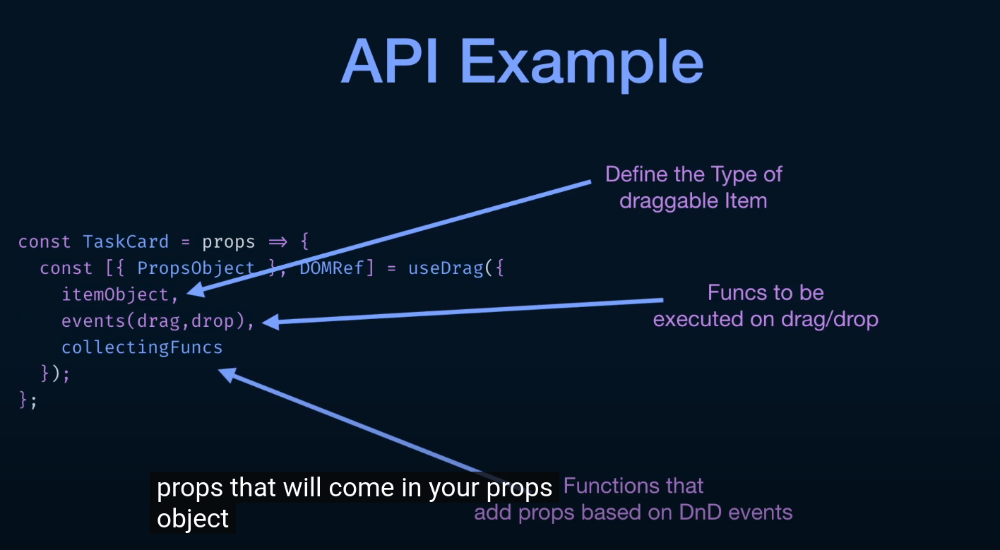

DOM ----- React DND ------- React
Monitors-----__-------Collectors


### Backends : 
    - HTML5 : Support HTML5 DND Events
    - Touch - Support touch events
    - Test : Supports testing Dnd Interactions

### Item Types:
    - The source of identity in your DNd Interactions
    - They specify what can be dropped on what
    - They carry information about dragged item

### Monitors:
    - Communicate DnD events from DOM to your React Components
    - Passed into React as context

### Collectors:
    - Function to turn DnD events,coming from Monitors into React Props. Collecting props.

### Drag Sources:
    - The Draggable Components
    - Carry information passed into Drop Targets

### Drop Target:
    - Accept certaint types of draggable
    - Execute fn on DnD events


```
DOM Events (DnD events happening on DOM Side) --> Monitors convert that to a state --> React DND --> Collectors convert that state to props --> React 

```


API Example:
- 


.png)